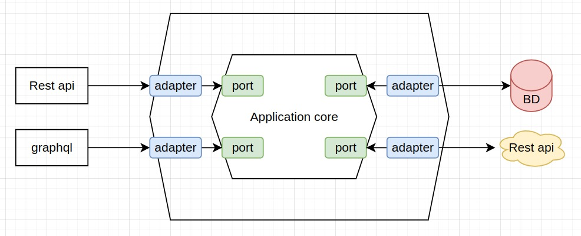

# Arquitetura Hexagonal

Api desenvolvida com o intuito de explorar um pouco a arquitetura hexagonal (Ports ands Adapters) que tem como principal foco o isolamento do core da aplicação (acoplamento), que deixa o mesmo funcional independente de tecnologias externas.  




[site de referencia : alistair.cockburn](https://alistair.cockburn.us/hexagonal-architecture/)

# Tecnologias

    java 11
    Spring boot 3.0.0
    Spring data JPA
    H2 database

# Estrutura da organização das pastas

```shell
./
├── ./src/main/java/br/com/bookapi
│   └── ./adapters
        └── ./input
            └── ./controller
            └── ./entity
            └── ./mapper
            └── ./request
            └── ./response
        └── ./ouput
            └── ./repository
|   └── ./application
        └── ./core
            └── ./domain
            └── ./service
        └── ./ports
            └── ./input
            └── ./output
|   └── ./config
├── ./README.md
```